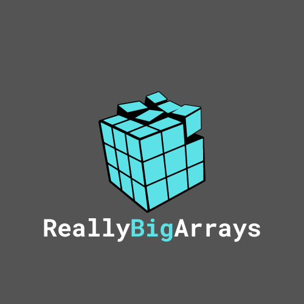

# ReallyBigArrays

  

ReallyBigArrays is a Java library for computing really big arrays. It provides a set of powerful multi-dimensional array structures.

ReallyBigArrays features three main types of arrays:
1. `Vector` is a simple 1 dimensional array. It has a length and allows you to access and set elements.
2. `Matrix` is a 2 dimensional array. Like a table it has rows and columns.
3. `Tensor` is a 3 dimensional array. It has rows, columns, and layers that it can store data.
